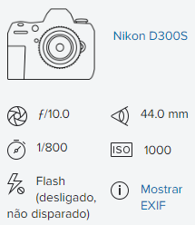
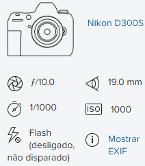

01\.jpg - Retirado de Freepik: https://br.freepik.com/fotos-gratis/pense-em-palavras-positivas-na-tipografia-de-texto-anaglifo\_17597862.htm

02\.jpg - Retirado de Freepik: https://br.freepik.com/vetores-gratis/efeito-de-texto-esportivo-de-tempo-extra\_81443604.htm

03\.jpg - Retirado de Freepik: https://br.freepik.com/vetores-gratis/conjunto-colorido-do-alfabeto-simbolo-doodle-fonte-estilo\_14921218.htm

04\.jpg - Retirado de Flickr: https://www.flickr.com/photos/agenciabrasilia/51052130176

Dados **EXIF**

|
Compression - JPEG (old-style)

Make - NIKON CORPORATION

X-Resolution - 300 dpi

Y-Resolution - 300 dpi

Software - Adobe Photoshop Lightroom Classic 10.1.1 (Windows)

Date and Time (Modified) - 2021:03:03 15:09:44

Artist - PAULO H CARVALHO

YCbCr Positioning - Centered

Copyright - PAULO H CARVALHO

ISO Speed - 1000

Exif Version - 0231

Date and Time (Original) - 2021:03:03 10:32:52

Date and Time (Digitized) - 2021:03:03 10:32:52

Offset Time - -03:00

Components Configuration - Y, Cb, Cr, -

Exposure Bias - 0 EV

Max Aperture Value - 2.8

Metering Mode - Multi-segment

Light Source - Unknown

Sub Sec Time Original - 42

Flashpix Version - 0100

Color Space - sRGB

Sensing Method - One-chip color area

File Source - Digital Camera

Scene Type - Directly photographed

CFAPattern - [Red,Green][Green,Blue]

Custom Rendered - Normal

Exposure Mode - Manual

White Balance - Auto

Digital Zoom Ratio - 1

Focal Length (35mm format) - 66 mm

Scene Capture Type - Standard

Gain Control - High gain up

Contrast - Normal

Saturation - Normal

Sharpness - Normal

Subject Distance Range - Unknown

Coded Character Set - UTF8

Envelope Record Version - 4

Application Record Version - 4

Date Created - 2021:03:03

Time Created - 10:32:52-08:00

Digital Creation Date - 2021:03:03

Digital Creation Time - 10:32:52-08:00

By-line - PAULO H CARVALHO

Copyright Notice - PAULO H CARVALHO

IPTCDigest - 70e5c54bbafbe3581a2020d6bbdef095

XMPToolkit - Adobe XMP Core 5.6-c140 79.160451, 2017/05/06-01:08:21

Creator - PAULO H CARVALHO

Format - image/jpeg

Rights - PAULO H CARVALHO

Creator Tool - Adobe Photoshop Lightroom Classic 10.1.1 (Windows)

Metadata Date - 2021:03:03 15:09:44-03:00

Derived From Document ID - xmp.did:4c8b0d62-a68a-5544-87de-569574f8e997

Derived From Instance ID - xmp.iid:4c8b0d62-a68a-5544-87de-569574f8e997

Derived From Original Document ID - xmp.did:4c8b0d62-a68a-5544-87de-569574f8e997

Document ID - xmp.did:a3332238-703e-3243-8540-f7d8eaa04f02

Instance ID - xmp.iid:a3332238-703e-3243-8540-f7d8eaa04f02

Original Document ID - xmp.did:4c8b0d62-a68a-5544-87de-569574f8e997

Preserved File Name - escola classe 03 da Ceilandia (1).JPG

Camera ID - 72157621782301411

Camera Type - Digital SLR
|
| :- |

05\.jpg - Retirado de Flickr: https://www.flickr.com/photos/agenciabrasilia/51051410128/

Dados **EXIF**

|
Compression - JPEG (old-style)

Make - NIKON CORPORATION

X-Resolution - 300 dpi

Y-Resolution - 300 dpi

Software - Adobe Photoshop Lightroom Classic 10.1.1 (Windows)

Date and Time (Modified) - 2021:03:03 15:09:36

Artist - PAULO H CARVALHO

YCbCr Positioning - Centered

Copyright - PAULO H CARVALHO

ISO Speed - 1000

Exif Version - 0231

Date and Time (Original) - 2021:03:03 10:19:03

Date and Time (Digitized) - 2021:03:03 10:19:03

Offset Time - -03:00

Components Configuration - Y, Cb, Cr, -

Exposure Bias - 0 EV

Max Aperture Value - 2.8

Metering Mode - Multi-segment

Light Source - Unknown

Sub Sec Time Original - 63

Flashpix Version - 0100

Color Space - sRGB

Sensing Method - One-chip color area

File Source - Digital Camera

Scene Type - Directly photographed

CFAPattern - [Red,Green][Green,Blue]

Custom Rendered - Normal

Exposure Mode - Manual

White Balance - Auto

Digital Zoom Ratio - 1

Focal Length (35mm format) - 28 mm

Scene Capture Type - Standard

Gain Control - High gain up

Contrast - Normal

Saturation - Normal

Sharpness - Normal

Subject Distance Range - Unknown

Coded Character Set - UTF8

Envelope Record Version - 4

Application Record Version - 4

Date Created - 2021:03:03

Time Created - 10:19:03-07:00

Digital Creation Date - 2021:03:03

Digital Creation Time - 10:19:03-07:00

By-line - PAULO H CARVALHO

Copyright Notice - PAULO H CARVALHO

IPTCDigest - 1b2dd367e37926596b16953127c94fe5

XMPToolkit - Adobe XMP Core 5.6-c140 79.160451, 2017/05/06-01:08:21

Creator - PAULO H CARVALHO

Format - image/jpeg

Rights - PAULO H CARVALHO

Creator Tool - Adobe Photoshop Lightroom Classic 10.1.1 (Windows)

Metadata Date - 2021:03:03 15:09:36-03:00

Derived From Document ID - xmp.did:d04cc978-ca7d-5240-9809-321e5dadde7f

Derived From Instance ID - xmp.iid:d04cc978-ca7d-5240-9809-321e5dadde7f

Derived From Original Document ID - xmp.did:d04cc978-ca7d-5240-9809-321e5dadde7f

Document ID - xmp.did:dc217f0e-c9b0-0b43-a22a-2c759b8c510f

Instance ID - xmp.iid:dc217f0e-c9b0-0b43-a22a-2c759b8c510f

Original Document ID - xmp.did:d04cc978-ca7d-5240-9809-321e5dadde7f

Preserved File Name - Bombeiro da Ceilancia (7).JPG

Camera ID - 72157621782301411

Camera Type - Digital SLR
|
| :- |

