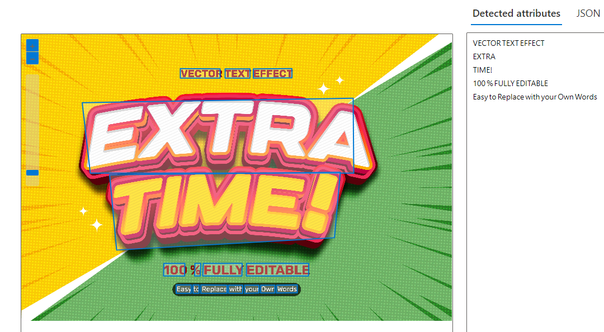
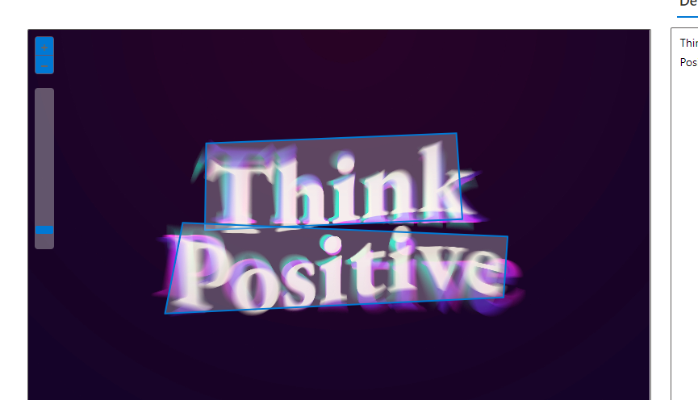
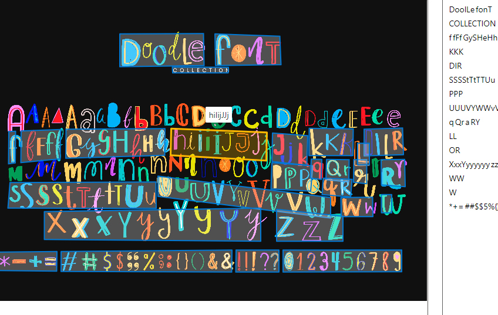

**Curso do [DIO](https://web.dio.me) (BootCamp - Microsoft Azure AI Fundamentals)**

Explorando os Recursos de IA Generativa com Copilot e OpenAI

Links importantes:

<https://microsoftlearning.github.io/mslearn-ai-fundamentals/Instructions/Labs/14-azure-openai-content-filters.html>

<https://microsoftlearning.github.io/mslearn-ai-fundamentals/Instructions/Labs/13-azure-openai.html>

<https://microsoftlearning.github.io/mslearn-ai-fundamentals/Instructions/Labs/12-generative-ai.html>

<https://portal.vision.cognitive.azure.com/>

Alguns prints:

